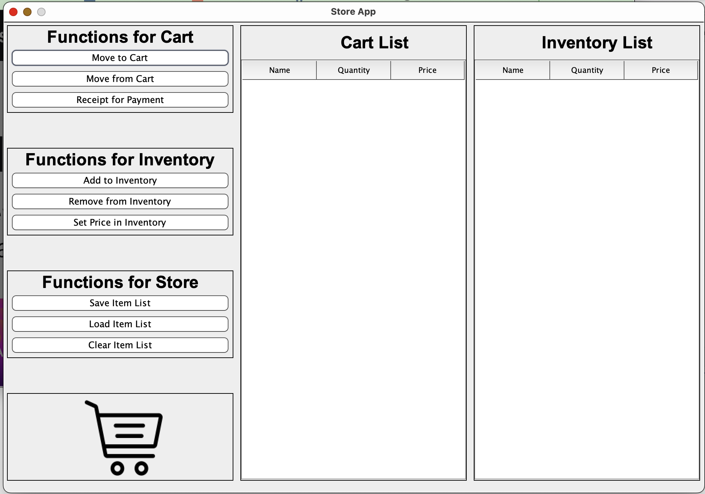

# **UBC Personal Project**

## Tsun Li Nicholas Tam
## *Student Number: 45695970*

### Description
This project is intended to be used as an inventory system for shopkeepers and cashiers to keep track of items in a 
convenience store. It will contain most of the general operations to allow the system to function, such as creating a 
receipt, keep track of the availability of items, search for specific items, and so on.



### User Stories:
- As a user, I want to be able to access the properties of each item
    - As a user, I want to be able to access the quantity of each item in the store
        - As a user, I want to be able to mark items as available for purchase depending on quantity
        - As a user, I want to be able to increase or decrease the quantity of each item available for purchase by a 
certain amount
    - As a user, I want to be able to access the name of each item
      - As a user, I want to be able to change the name of each item

- As a user, I want to be able to view the list of items in a store, one for cart and another for inventory
  - As a user, I want to be able to search for a specific item in the list and change its price
  - As a user, I want to be able to add items to the inventory
  - As a user, I want to be able to remove items from the inventory
  - As a user, I want to be able to move items between cart and inventory lists

- As a user, I want to be able to obtain a receipt for the customer
  - As a user, I want to be able to print out the list of items purchased and their quantities
  - As a user, I want to be able to output the total price of the items and corresponding tax

- As a user, I want to be able to save a single item list
  - As a user, I want to be able to reload an existing item list

[//]: # (- As a user, I want to be able to access multiple stores with their own item lists &#40;e.g. Store A and Store B are from)
[//]: # (    the same company and at different locations&#41;)

### Instructions for Grader
- You can add Items to the Inventory by the following steps:
  1. Click on the "Add to Inventory" button in the middle panel on the left side of the screen
  2. Input the name, quantity and price of the new Item
  3. Redo the inputs accordingly for the new Item if an ERROR_MESSAGE pops up; otherwise, close the message
- You can move Items from Inventory to Cart by the following steps:
  1. Click on the "Move to Cart" button in the top panel on the left side of the screen
  2. Input the name and quantity of the Item(s) to be transferred
  3. Redo the inputs accordingly for the Item to be transferred if an ERROR_MESSAGE pops up; otherwise, close the message
- You can locate my visual component (a cart image) in the bottom left corner of the screen
- You can save the state of my application by the following steps:
  1. Click on the "Save Item List" button
  2. Select the ItemList to be saved (Inventory or Cart)
- You can reload the state of my application by the following steps:
  1. Click on the "Load Item List" button
  2. Select the ItemList to be loaded (Inventory or Cart)
  3. Loaded ItemList should pop up on corresponding screen

### Phase 4: Task 2
Sample of events
- Moving Items from Inventory to Cart consists of takeFromList and putIntoList
- Moving Items from Cart to Inventory consists of takeFromList and putIntoList
- Loading state consists of clear and putIntoList
  - putIntoList events print once for ItemList in .json file and once for ItemList in system, both with the same name 
  due to how JsonWriter is structured

```
Tue Nov 22 18:32:42 PST 2022
10 Apple put into Inventory

Tue Nov 22 18:32:48 PST 2022
5 Apple taken from Inventory

Tue Nov 22 18:32:52 PST 2022
Apple price changed to 3.0 in Inventory

Tue Nov 22 18:32:56 PST 2022
3 Apple taken from Inventory

Tue Nov 22 18:32:56 PST 2022
3 Apple put into Cart

Tue Nov 22 18:33:05 PST 2022
2 Apple taken from Cart

Tue Nov 22 18:33:05 PST 2022
2 Apple put into Inventory

Tue Nov 22 18:33:10 PST 2022
Inventory cleared

Tue Nov 22 18:33:10 PST 2022
5 Apple put into Inventory

Tue Nov 22 18:33:10 PST 2022
6 Orange put into Inventory

Tue Nov 22 18:33:10 PST 2022
5 Apple put into Inventory

Tue Nov 22 18:33:10 PST 2022
6 Orange put into Inventory

Tue Nov 22 18:33:15 PST 2022
Cart cleared

Tue Nov 22 18:33:15 PST 2022
5 Apple put into Cart

Tue Nov 22 18:33:15 PST 2022
10 Orange put into Cart

Tue Nov 22 18:33:15 PST 2022
5 Apple put into Cart

Tue Nov 22 18:33:15 PST 2022
10 Orange put into Cart

Tue Nov 22 18:33:19 PST 2022
Inventory has items saved

Tue Nov 22 18:33:21 PST 2022
Cart has items saved

Tue Nov 22 18:33:24 PST 2022
Inventory cleared

Tue Nov 22 18:33:27 PST 2022
Cart cleared
```

### Phase 4: Task 3
- Could have changed the loading function to not rely on the putIntoList method, which would minimise confusion from 
the EventLog
- More efficient way to create tool functions in system
- Reformat the panel creation in StoreAppGUI to allow changes in screen size (Currently only works with fixed size) 
